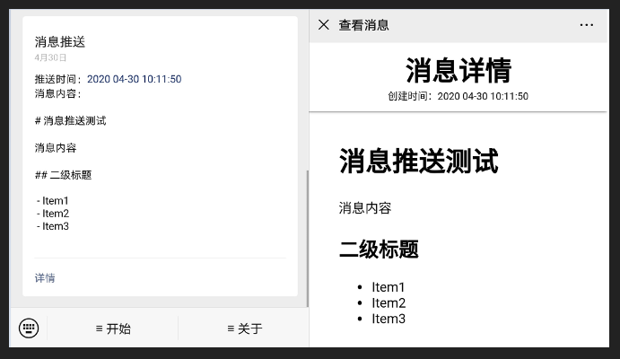

# wx-pusher

简陋版本的[server 酱](http://sc.ftqq.com/3.version)

**实现功能**

- 调用`api`给自己推送消息
- 查看消息

**TODO**

- 美化消息展示页面
- 添加更多`API`

**测试**

这里提供了一个demo, 你可以关注下面的测试账号


关注后，点击获取`token`

使用api进行消息推送

 - **API** https://wx.dreamer2q.wang/api/push

**DEMO**



# API

- `api/push`

```c
Method: POST, GET
Params:
    -  token //关注微信号获取
    -  msg   //支持markdown
Result:
{
    "err": 0,
    "msg": "success",
    "data": {
        "msgId": "1588211160692880600",
        "url": "http://your.domain/show?id=1588211160692880600"
    }
}
```

# 开始使用

1. 申请微信[测试账号](https://mp.weixin.qq.com/debug/cgi-bin/sandbox?t=sandbox/login)
2. 配置模板消息，获取模板 ID

示例

```c
推送时间：{{time.DATA}}
消息内容：

{{msg.DATA}}
```

3. 修改代码相应[发送部分](https://github.com/dreamer2q/wx-pusher/blob/master/service/wechat/api.go)
4. 配置`mysql`，用来储存`token`
5. 配置`redis`，缓存消息
6. 测试

# 关于

主要是用来学习`golang`的`api`开发，熟悉如何使用`gin`库来写服务

使用的库

- gin
- gorm
- redis
- blackfriday
- go_wechat
- logrus
- uuid
- ...


# LICENSE

[MIT](https://github.com/dreamer2q/wx-pusher/blob/master/LICENSE) 
